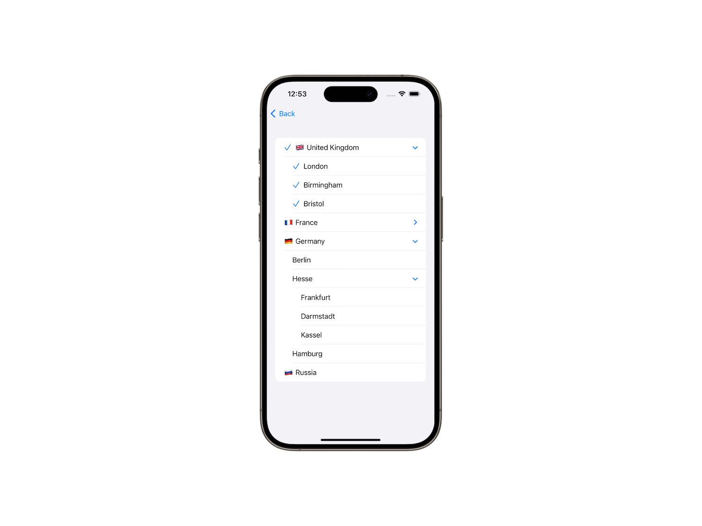

# TreePicker

**WORK IN PROGRESS. PLEASE, DON'T USE THIS PACKAGE.**

A pack of SwiftUI tree pickers that provide selecting options from hierarchical data. Pickers work on iOS and visionOS. Library hasn't third-party dependencies.



[](https://github.com/borisovodov/TreePicker/releases)
[](https://github.com/borisovodov/TreePicker/actions/workflows/workflow.yaml)
[](https://codecov.io/gh/borisovodov/TreePicker)
[//]: # (Lowest supported macOS version, https://img.shields.io/badge/macOS-13+-blue)


## Features

Рассказать, что это либа с тремя пикерами, которые обеспечивают выбор из иерархического дерева.

## Installation

### In Xcode

`.xcproject` → PROJECT → Package Dependencies → + → search "https://github.com/borisovodov/TreePicker" → Add Package

After that add `import TreePicker` in your source code.

## Usage

Пример: https://swiftpackageindex.com/btfranklin/CleverBird, https://swiftpackageindex.com/apple/app-store-server-library-swift

Допустим возьмём такое-то дерево

```swift
struct Location: Hashable, Identifiable {
    let id = UUID()
    var title: String
    var children: [Location]?
}

private let locations: [Location] = [
    .init(title: "🇬🇧 United Kingdom", children: [
        .init(title: "London", children: nil),
        .init(title: "Birmingham", children: nil),
        .init(title: "Bristol", children: nil)
    ]),
    .init(title: "🇫🇷 France", children: [
        .init(title: "Paris", children: nil),
        .init(title: "Toulouse", children: nil),
        .init(title: "Bordeaux", children: nil)
    ]),
    .init(title: "🇩🇪 Germany", children: [
        .init(title: "Berlin", children: nil),
        .init(title: "Hesse", children: [
            .init(title: "Frankfurt", children: nil),
            .init(title: "Darmstadt", children: nil),
            .init(title: "Kassel", children: nil),
        ]),
        .init(title: "Hamburg", children: nil)
    ]),
    .init(title: "🇷🇺 Russia", children: nil)
]
```

Нужно импортировать библиотеку.

Тогда это можно вот так использовать

```swift
@State private var multiSelection: Set<UUID> = []

var body: some View {
    NavigationStack {
        Form {
            TreeMultiPicker("Location", data: locations, children: \.children, selection: $multiSelection) { location in
                Text(location.title)
            }
        }
    }
}
```

[//]: # (Выглядеть на картинках это будет вот так на iOS.)

[//]: # (Описание картинки для iOS)

Рассказать про data и dataID и возможности data когда Identifable

Рассказать про children

Рассказать про три разных пикера с тремя разными selection. Рассказать по какому принципу производится выделение элементов в зависимости от типа selection

Рассказать про разные методы селекшена в разных типах пикера

Рассказать про rowContent

Рассказать про lable

Рассказать про emptySelectionContent и для каких пикеров он доступен
