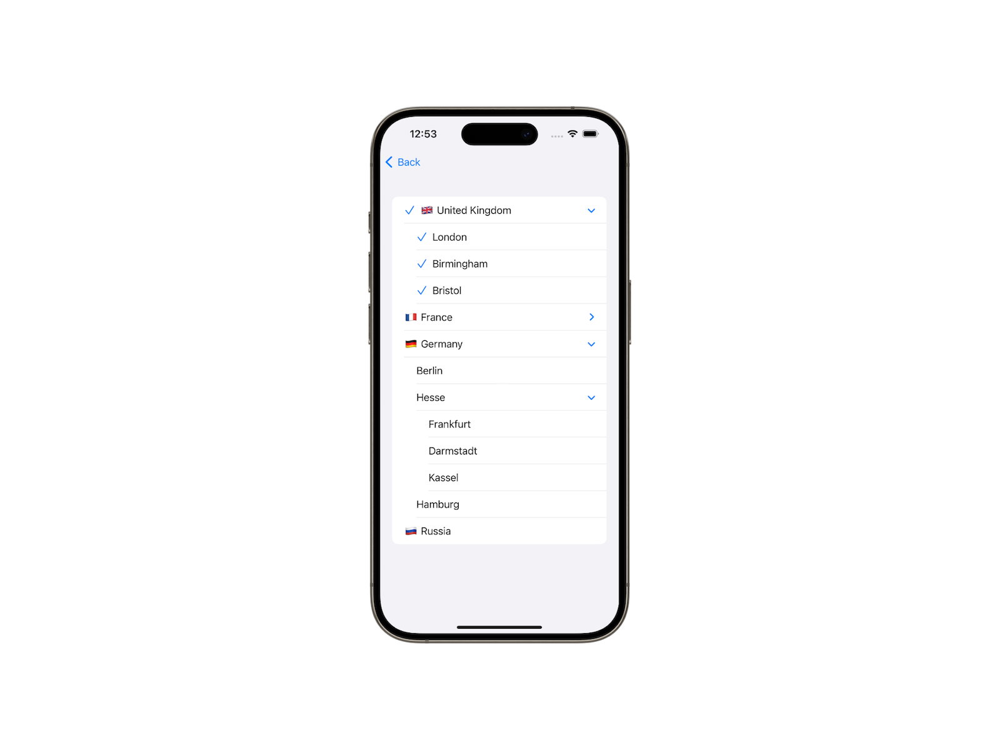

# TreePicker

A pack of SwiftUI tree pickers that provide selecting options from hierarchical data. Pickers work on iOS, iPadOS and visionOS. Library hasn't third-party dependencies.

## Features

`TreePicker` package has several tree pickers for different selection value: exactly one selected value, optional value and set of values. Use `TreeSinglePicker`, `TreeOptionalPicker` and `TreeMultiPicker` respectively.

Work with hierarchical data, it's children and selection is similar to SwiftUI hierarchical `List`. Additionaly you can specify selection method. Next methods available:
* Only leaves (nodes without children) are selectable.
* All nodes (include *folders*) are selectable.
* All nodes are selectable and selecting a node automatically selects all its child nodes. This method is available for `TreeMultiPicker` only.

## Usage

See the [documentation](https://swiftpackageindex.com/borisovodov/TreePicker/main/documentation/treepicker).
